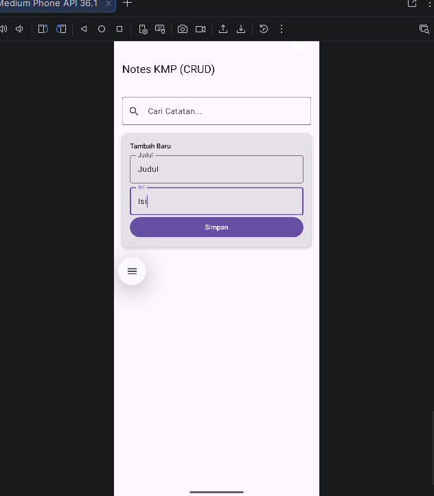
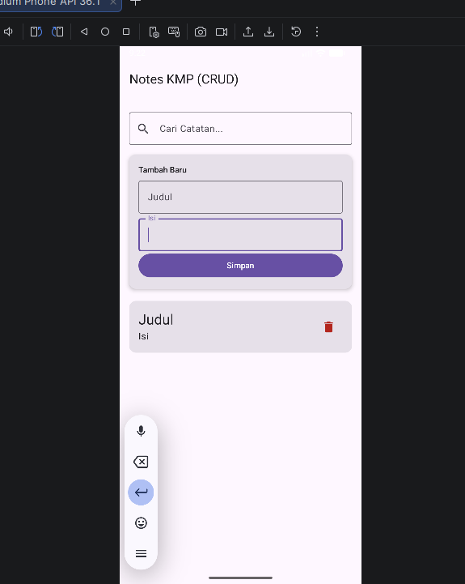
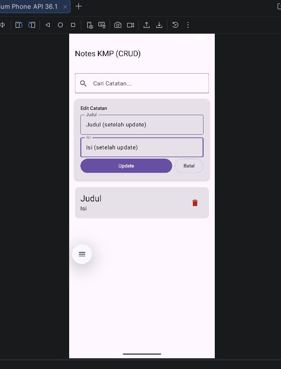
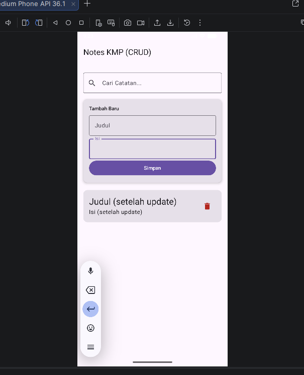
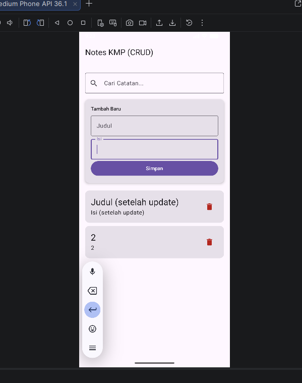
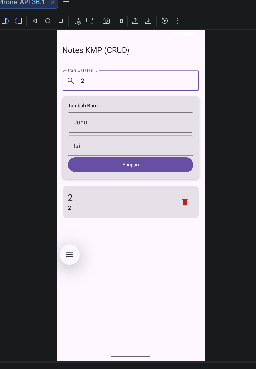
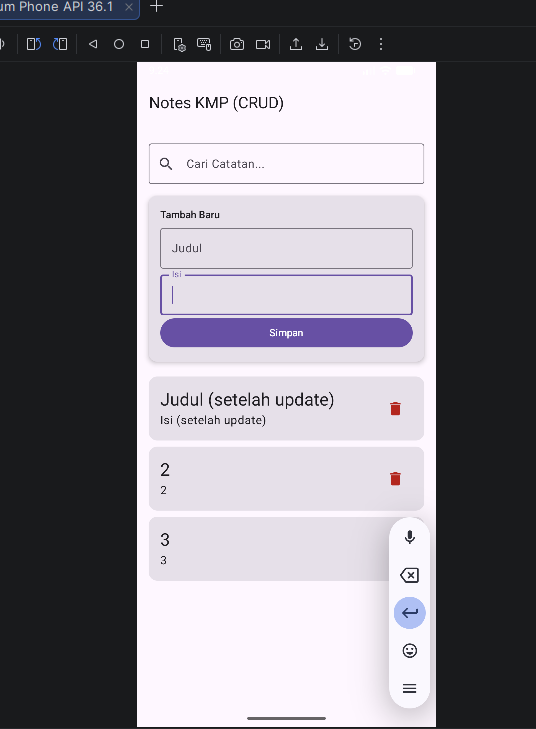
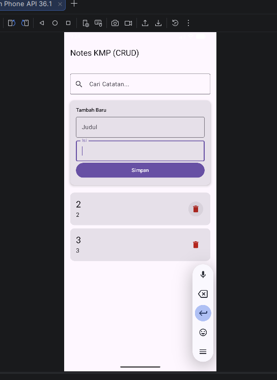

Notes App
Aplikasi catatan sederhana yang dibangun menggunakan Kotlin Multiplatform (KMP). Aplikasi ini memungkinkan berbagi logika bisnis dan antarmuka pengguna (UI) di platform Android, iOS, dan Desktop (JVM) menggunakan satu basis kode.

🛠️ Teknologi yang Digunakan
Compose Multiplatform: Framework untuk membangun UI deklaratif lintas platform.

SQLDelight: Library database untuk mengelola SQLite dengan keamanan tipe data (type-safe).

Coroutines & Flow: Digunakan untuk menangani operasi asynchronous dan pembaruan data secara real-time pada UI.

Material 3: Standar desain antarmuka modern dari Google.

📂 Arsitektur Proyek
Aplikasi ini menggunakan pola Expect/Actual untuk menangani perbedaan spesifik antar platform:

commonMain: Berisi UI utama (App.kt) dan logika database yang sama untuk semua platform.

androidMain: Implementasi database menggunakan AndroidSqliteDriver yang membutuhkan Context.

iosMain: Implementasi menggunakan NativeSqliteDriver untuk ekosistem Apple.

jvmMain: Implementasi menggunakan JdbcSqliteDriver untuk aplikasi Desktop.

📝 Fitur CRUD & Pencarian
Berdasarkan skema database Note.sq, aplikasi mendukung:

Create: Menambahkan catatan baru dengan judul dan isi.

Read: Menampilkan daftar catatan yang diurutkan dari yang terbaru (ORDER BY created_at DESC).

Update: Mengubah judul atau isi catatan yang sudah ada.

Delete: Menghapus catatan secara permanen dari database.

Search: Mencari catatan berdasarkan kata kunci pada judul atau isi menggunakan operator LIKE.

⚙️ Cara Menjalankan Proyek
Generate Database: Jalankan perintah ./gradlew generateSqliteDatabaseInterface di terminal Android Studio agar class database otomatis terbentuk.

Sync Gradle: Pastikan semua library terpasang dengan menekan ikon gajah (Sync Project with Gradle Files).

Run: Pilih target (Android Emulator, iOS Simulator, atau Desktop) dan tekan tombol Run.

Dokumentasi
-------------------------------------------------------------------------------------------------

